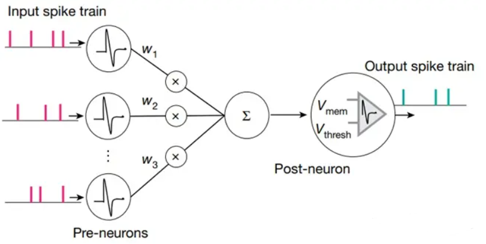
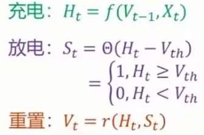
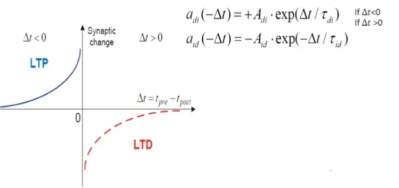

# ANN vs SNN

## SNN神经元结构

主要特性：

- 充分利用时空信息，脉冲数据将时间作为附加的输入维度（以稀疏的方式记录了有价值的信息）
- 脉冲神经元由任务驱动的，能耗低
- 具有良好的生物可解释性

## 信息编码和表示

SNN使用时间编码方案将信息编码为**脉冲序列**,ANN使用速率编码方案将信息编码为标量。相比之下,SNN在处理复杂的时间或时空数据时具有更强大的信息表示能力。

## 计算单元和网络仿真

ANN的基本计算单元是人工神经元,其中输入由激活函数处理;SNN的基本计算单元是**脉冲神经元**,由微分方程表示。ANN的仿真策略是一个循序渐进的仿真过程,SNN主要是基于**时钟驱动**和**事件驱动**的仿真过程。

## 突触可塑性和学习

SNN的突触可塑性机制强调**突触前和突触后**神经元之间的脉冲时间依赖性可塑,而ANN的机制一般满足Hebb规则。与ANN误差反向传播算法不同的是,SNN目前研究中最大的困难是由复杂动力学机制和网络梯度在反向传播中的不连续和不可微分问题导致的训练难题。

## 并行和硬件实现

SNN可以实现快速和大规模**并行**的信息处理,而ANN相对较弱。SNN使用离散脉冲序列代替模拟信号来传输信息,更适合低能耗的硬件实现。

## LIF模型

描述了神经元的膜电位（membrane potential）如何随时间演变，并在达到一定阈值时产生脉冲（尖峰）。该模型的基本思想是，神经元的膜电位在没有输入的情况下会逐渐漏掉，同时接收到来自输入的电流。
\[ \tau \frac{dV}{dt} = -(V - V_{\text{rest}}) + R I_{\text{syn}} \]

其中：
- \( V \) 是膜电位；
- \( \tau \) 是膜电位的时间常数，表示膜电位从初始值向静息电位 \( V_{\text{rest}} \) 漏的速率；
- \( R \) 是膜电阻；
- \( I_{\text{syn}} \) 是来自突触的输入电流。

\[ V(t + \Delta t) = V(t) + \frac{\Delta t}{\tau} \left( -(V(t) - V_{\text{rest}}) + R I_{\text{syn}} \right) \]

## STDP(脉冲时序依赖可塑性)

若突触前脉冲比突触后脉冲到达时间早，会导致Long-Term Potentiation(LTP)效应，即权重会增加。反之，若突触前脉冲比突触后脉冲到达时间晚，会引起long-term depression(LTD)，即权重会减小。基于这个原理，可以实现无监督地对SNN参数的更新。在这两个公式中，A表示学习率，τ表示时间常数，控制电压下降的速度。
